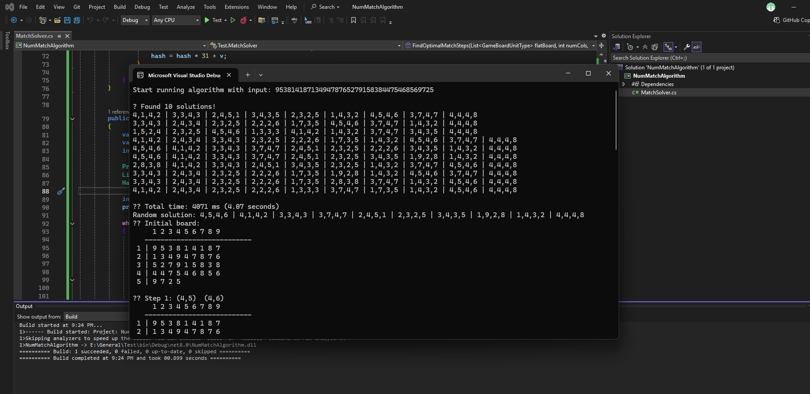

# 📐 Algorithm Specification – NumMatch Optimal Solution Finder

## 🧩 Objective

Tìm **tối đa 10 đường đi ngắn nhất** để gom hết tất cả các số `target` (mặc định là số 5) trên một bảng số dạng lưới. Mỗi bước là một thao tác **match hợp lệ**, thỏa mãn:

-   Hai số có tổng bằng 10 **hoặc** bằng nhau.
-   Có thể nối trực tiếp bằng một đường **ngang**, **dọc**, **chéo chính**, hoặc **chéo phụ** và **không bị chắn**.

---

## 📥 Input Format

-   Một chuỗi số từ 1–9, ví dụ:  
    `"9538141871349478765279158384..."`
-   Số nguyên `numCols`: số cột của lưới (thường là 9).
-   `targetType`: kiểu số cần gom hết (ví dụ `Five`).

---

## 📤 Output Format

-   Tối đa **10 giải pháp** có độ dài (số bước) ngắn nhất.
-   Mỗi solution có định dạng:  
    `rowA,colA,rowB,colB|rowA,colA,rowB,colB|...`
-   Giá trị `row` và `col` bắt đầu từ **1** (base-1).

---

## 🔍 Algorithm Description

### 1. Khởi tạo

-   Xem code liên quan trong file `MatchSolver.cs`.
-   Chuyển input string thành `List<GameBoardUnitType>`.
-   Convert sang mảng 1 chiều `GameBoardUnitType?[]`.
-   Đếm số lượng `target` hiện có.

### 2. Chiến lược A\* Search

Áp dụng thuật toán **A\*** với:

| Thành phần | Ý nghĩa                                                                                                |
| ---------- | ------------------------------------------------------------------------------------------------------ |
| `g(n)`     | Số bước match đã thực hiện                                                                             |
| `h(n)`     | Số bước ước lượng cần để gom nốt `target` (hiện đang để `h(n) = 0` do chưa tìm được công thức phù hợp) |
| `f(n)`     | Tổng ưu tiên = `g(n) + h(n)`                                                                           |

> Thuật toán chọn `BoardState` có `f(n)` thấp nhất để duyệt tiếp.

### 3. Sinh các bước mới

-   Với mỗi `BoardState`, tạo ra các bước `match` có thể thực hiện (tuân theo luật game).
-   Với mỗi bước:
    -   Cập nhật `Board` tạm thời (bằng `ApplyMatchSteps`).
    -   Kiểm tra xem đã gom hết target chưa.
    -   Nếu chưa, enqueue tiếp vào `PriorityQueue`.

### 4. Ngăn lặp (Loop Prevention)

-   Với mỗi trạng thái `Board`, sinh ra **hash key (int)**.
-   Dùng `HashSet<int>` để bỏ qua các trạng thái đã duyệt.

---

## 📦 Data Structures

| Tên             | Loại                  | Mô tả                             |
| --------------- | --------------------- | --------------------------------- |
| `BoardState`    | `List<MatchStep>`     | Chuỗi các bước match đã thực hiện |
| `PriorityQueue` | `BoardState, int`     | Ưu tiên node có `f(n)` nhỏ nhất   |
| `MatchStep`     | `rowA,colA,rowB,colB` | Một bước match giữa 2 vị trí      |
| `HashSet<int>`  | Hash Key              | Tránh xét lại board đã duyệt      |

---

## 📈 Performance

### ⏳ Time Complexity (worst case)

O(b^d)

Trong đó:

-   `b`: Branching factor – số cặp match hợp lệ tại mỗi bước
-   `d`: Depth – số bước tối đa để gom hết `target`

### 🧠 Space Complexity

O(b × d)

Bao gồm:

-   `PriorityQueue` chứa các trạng thái duyệt
-   `List<MatchStep>` trong mỗi node
-   `HashSet<int>` lưu trạng thái board đã duyệt

> ⚠️ Với input dài (trên 50–60 số), thuật toán có thể sinh ra hàng triệu node → dễ gây tốn RAM hoặc treo, do đó hiện tại chỉ nên chạy với input dưới mức trên.

---

## 🧪 Example Execution

| Input (50 số)   | Thời gian chạy (console) |
| --------------- | ------------------------ |
| `9538141871...` | ~14 giây                 |

---

## 📌 Notes

-   ✅ Hiện chỉ xét match tất cả `target` với chính nó (ví dụ `5–5`)
-   ❌ Chưa mở rộng gom theo tổng 10 nếu `target ≠ 5`
-   🚫 Chưa có heuristic tốt → A\* vẫn duyệt nhiều node thừa
-   ⚠️ Unity chậm hơn Console App → nên debug trên console trước

---

## 🧪 Test Instructions

-   Có thể test bằng Console App để đo performance thực
-   Input: chỉnh trực tiếp trong `Main`
-   Kết quả: in ra Console
