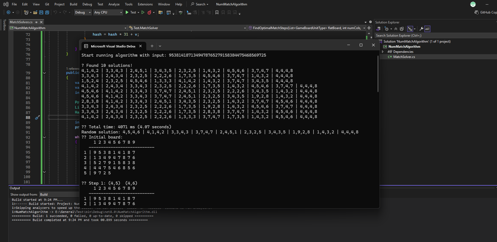
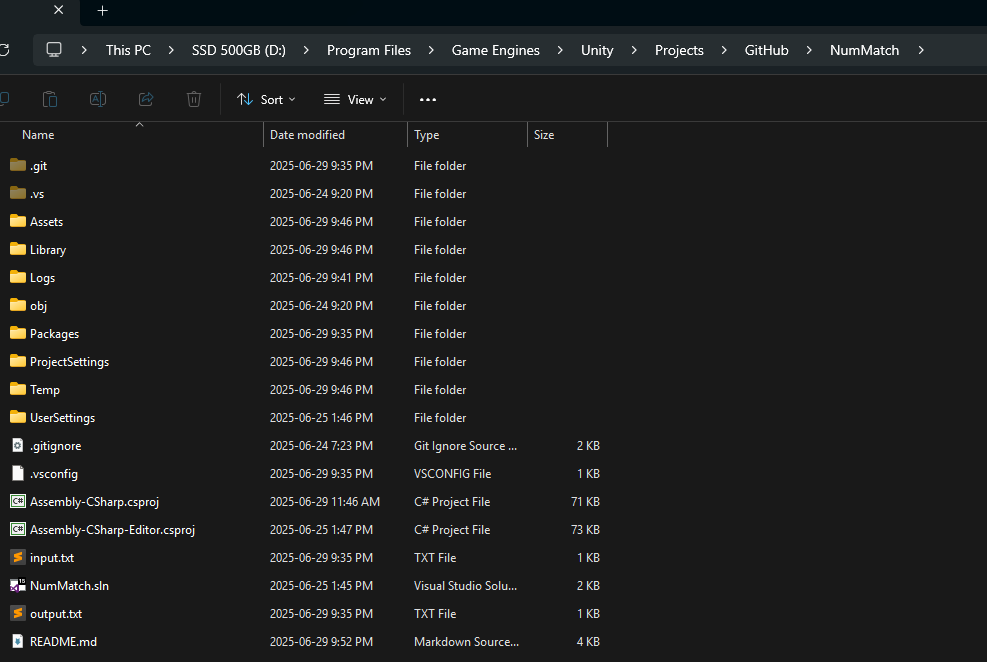

# 🧩 NumMatch Prototype Submission - Unity Developer Test

## 🔖 Project Prototype Info

-   📱 Game Type: Casual Puzzle
-   🛠 Engine: Unity 2021.3 LTS
-   👤 By: Nguyễn Khánh Toàn

---

## I. ⭐ Tổng Quan

📝 Prototype được xây dựng bám sát gameplay và UI của NumMatch bản gốc, bao gồm hai chế độ chơi: **Endless Mode** và **Move Mode** (thuật toán tìm bước đi tối ưu).

-   Cài đặt và chạy ứng dụng: tải bản Windows hoặc APK ở [link sau](https://drive.google.com/drive/folders/1AaezKvVoZfWMkk9PzOcODbX-wFOfKa-E?usp=sharing)

---

## II. 🎮 Chi Tiết Tính Năng (80 điểm)

### 1. Core – 25 điểm

-   [x] **Hiển thị danh sách số**: Bảng số được hiển thị bằng một lưới 2D có 9 cột.
-   [x] **Match Logic**: Hai số giống nhau hoặc tổng bằng 10, không bị chặn (ngang/dọc/chéo).
-   [x] **Input**: Tap chọn 2 số; tap lại để bỏ chọn; nếu không hợp lệ, cả hai bị huỷ.
-   [x] **Xử lý sau match**: Xoá số, clear hàng nếu cần, cập nhật trạng thái.
-   [x] **Âm thanh**: Phản hồi âm thanh cho các sự kiện chọn, xoá, UI tương tác.
-   [x] **Thêm số**: Copy toàn bộ số chưa xoá, nối vào cuối board.
-   [x] **UI**: Layout và button đầy đủ (Add, Home, Settings,...)

---

### 2. Gameplay – 25 điểm

-   [x] **Dữ liệu bằng mảng 1 chiều**: Dễ thao tác, thuật toán nhanh.  
         → Sử dụng `List<GameBoardUnit> allOccupiedUnitList` trong `GameBoard`.

-   [x] **Thuật toán generate board** đảm bảo:

    -   Mỗi màn có đủ số từ 1–9.
    -   Stage 1 có 3 cặp matchable, Stage 2 có 2 cặp, Stage ≥ 3 có 1 cặp.
    -   Phân phối đều các số.

-   [x] **Xử lý sau khi clear toàn bộ**:
    -   Tự động tăng stage và generate lại board.
    -   🧪 _Test nhanh:_ chỉnh `INITIAL_BOARD_LENGTH` để giảm số lượng ban đầu.

---

### 3. Mode – 30 điểm

#### a. Endless – 4 điểm

-   [x] Không có điều kiện thắng.
-   [x] Xử lý thua khi hết lượt thêm và không còn cặp match.  
         🧪 _Test nhanh:_ đặt `INITIAL_ADD_NUMBER_ATTEMPTS = 0`.

#### b. Move – 26 điểm

-   [x] ✅ Thuật toán tìm bước đi ngắn nhất để thu thập toàn bộ số **5**.
-   [x] ✅ Lưu 10 lời giải ngắn nhất vào `output.txt`.
-   [x] ✅ Format chuẩn: `rowA,colA,rowB,colB|...`

💡 **Chạy thuật toán:**

---

### 🔹 Chạy bằng Console App (Khuyến nghị)

-   Tải console project [Google Drive](https://drive.google.com/file/d/1SJ6FNT1DSlGz2XR4XSytrAMvD-afmwme/view?usp=sharing)
-   Sửa `input` trong `Main()` và chạy để lấy kết quả.
-   🖼️ Kết quả thuật toán in ra màn hình:

  

---

### 🔹 Chạy trực tiếp trên Unity Editor (Không khuyến nghị)

-   Đặt `input.txt` tại thư mục gốc project Unity.

  

-   Trong game, nhấn **Run Algorithm** và chờ xử lý.
-   File `output.txt` sẽ được tạo tại cùng thư mục với `input.txt`.

📘 Thuật toán được mô tả chi tiết tại [`Docs/Algorithm.md`](./Docs/Algorithm.md)

---

## IV. ✅ Yêu Cầu Kỹ Thuật (10 điểm)

| Mục kỹ thuật     | ✅  | Ghi chú                              |
| ---------------- | --- | ------------------------------------ |
| Unity 2021.3 LTS | ✅  | Phiên bản đúng theo đề bài           |
| Cấu trúc thư mục | ✅  | Có `Scripts/`, `UI/`, `Prefabs/`,... |
| Prefab tối ưu    | ✅  | Một prefab số duy nhất cho board     |
| Code rõ ràng     | ✅  | Có comment, chia file hợp lý         |

---

## V. ⏱️ Thời Gian Thực Hiện (10 điểm)

-   📅 Bắt đầu: **24/06/2025**
-   📅 Kết thúc: **29/06/2025**
-   ⏰ Tổng thời gian: Khoảng **49 giờ**, bao gồm polish UI & debug.

---

✉️ Cảm ơn anh/chị đã dành thời gian xem qua bài nộp!
